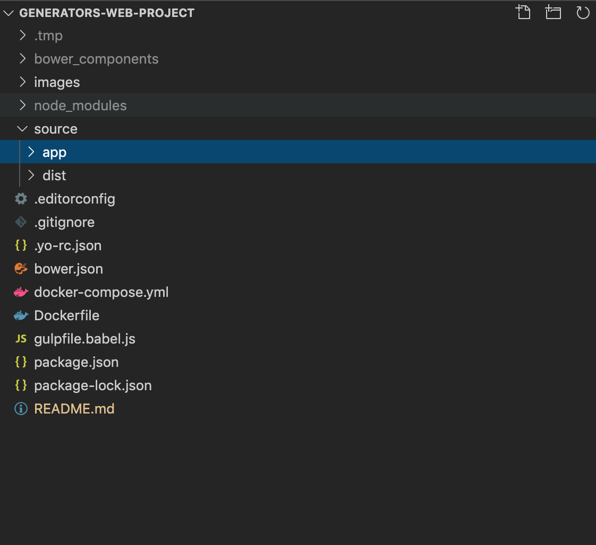

# Web Generators

  [](https://github.com/ozuit/generators-web-project/issues)

This is an skeleton web project for frontend developer. We used SASS, Gulp, and Browserify and utilizes best Frontend practices and Gulp best practices from [this resource](https://github.com/greypants/gulp-starter).

## Folders Structure



## Get Started

### Prerequisites

- You need to install [Docker](https://www.docker.com/get-started) before running this application.

### Installing

- Clone this repo from **[https://github.com/ozuit/generators-web-project.git](https://github.com/ozuit/generators-web-project.git)**

### Usage

- Run project with browser-sync. Your browser will automatically be opened and directed to the browser-sync proxy address. Now that gulp serve is running, any changes in the /app directory will be automatically processed by Gulp and the changes will be injected to any open browsers pointed at the proxy address.

```bash
docker-compose up
```

- Build on production. An **source/dist** directory will be created, it contain all js, css, html and images file optimized.

```bash
docker-compose run web gulp
```

## Document

Get more information at [wiki](https://github.com/ozuit/generators-web-project/wiki)

## Support

- If you have any problems with Web Generators don't hesitate to make an [issue](https://github.com/ozuit/generators-web-project/issues)
- Feel free to folk and submit pull requests

## Authors

- Tan Tong - *VNG Employee*
